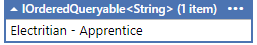
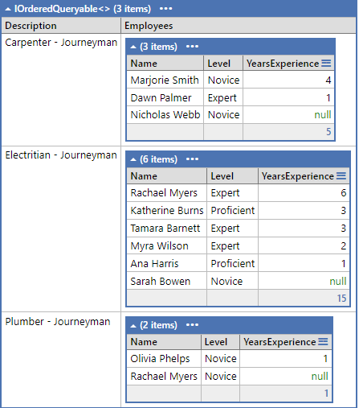
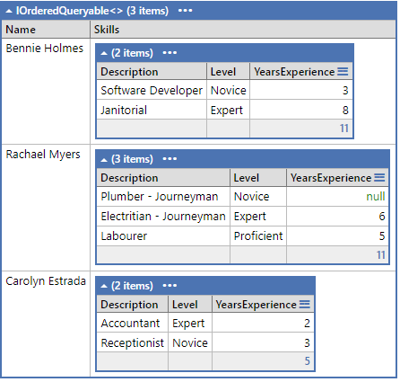
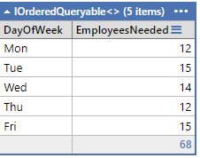
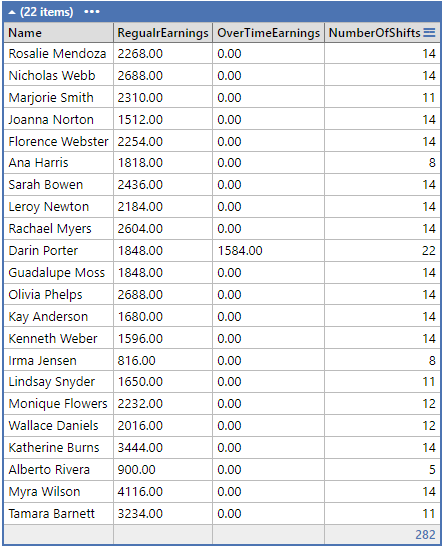

# LINQ and LinqPad Exercise (4 Marks)

## Private GitHub Repo Only

This exercise is based on the Work Schedule database. For this exercise, provide your answers as LinqPad (.linq) document(s). Use either A) a single LinqPad document for each question (you will use Expressions as the LinqPad environment) or B) a single LinqPad document containing all questions (you will need to use Statements as the LinqPad environment). You **must** do a commit after completing each question.

1. List all the skills for which we do not have any qualfied employees.

    

1. Show all skills requiring a ticket and which employees have those skills. Include all the data as seen in the following image. Order the employees by years of experience (highest to lowest). Use the following text for the levels: 1 = Novice, 2 = Proficient, 3 = Expert. (Hint: Use nested [ternary operators](https://msdn.microsoft.com/en-us/library/ty67wk28.aspx) to handle the levels as text.)

    

1. List all employees with multiple skills; ignore employees with only one skill. Show the name of the employee and the list of their skillsets; for each skill, show the name of the skill, the level of competance and the years of experience. Use the following text for the levels: 1 = Novice, 2 = Proficient, 3 = Expert.

    

1. From the shifts scheduled for NAIT's placement contracts, show the number of employees needed for each day (ordered by day-of-week). Display the name of the day of week (Sunday, as the first day of the week, is number zero) and the number of employees needed.

    

1. List all the employees with the most years of experience.

    

1. For the month of March, list the total earnings per employee along with the number of shifts, the regular earnings, and overtime earnings.

    **Note 1:** Remember that handling DateTime and TimeSpan calculations is best done in-memory; therefore, you should use a .ToList() in your linq's `from` clause so that the linq query is not converted to SQL.  

    **Note 2:** When doing your earnings calculations, remember that it's permissible to use method syntax inside of your linq query syntax.

    
