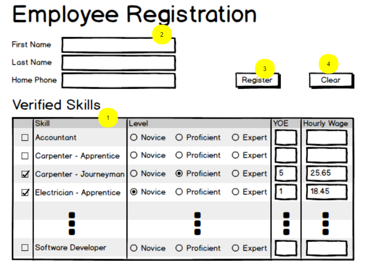

# Transaction Integrated Implementation Exercise (5 marks)

Given the following user-interface form, using your transaction service method, create a work web page that will register new skill(s) for an existing employee and/or register a new employee and their skill(s). Create a second page that will take in an employee phone number and return the employee first name, lastname and a collection of employee skills. The second page will display the data.
Follow the guidance and examples given by your instructor for your integrating your service method with the web form. The form is designed to collect a 
employee skill registration information. The individual may be a completely new employee or an existing employee registering a new skill. Remember that the entire form will be processed as a single transaction in the BLL.

## Register page

Note the following requirements when processing in the register form:

Clear

- Clears the current form of data

Register

- Employee and Skill data will be passed to your service method in your class library. 
- Must handle errors in a user friendly manner.
- Setup the skill table to collect all information into a single collection.
- Issue a success message if the transaction was successful.
- The post method will validate that the last name, first name and phone number were supplied before calling service method.

Note the following requirements when integrating your class library:

- setup an extension method within the class library to be called by **Program.cs**
- setup up your **user-secret** to handle the connection string
- register your service method within the extension method.
- implement your serivce method (from previous lab) into your class library
- implement your CQRS data models as public classes
- **both** context and entity classes **must** be internal

## Display Page

Note the following requirements when processing in the **display** form:

Clear

- Clears the current form of data

Fetch

- Phone data will be passed to your service method in your class library. 
- Must handle errors in a user friendly manner.
- The post method will validate that the phone number were supplied before calling service method.

Note the following requirements when integrating your class library:

- create a serivce method which will return the request query data
- register your service method within the extension method.

## ERD

