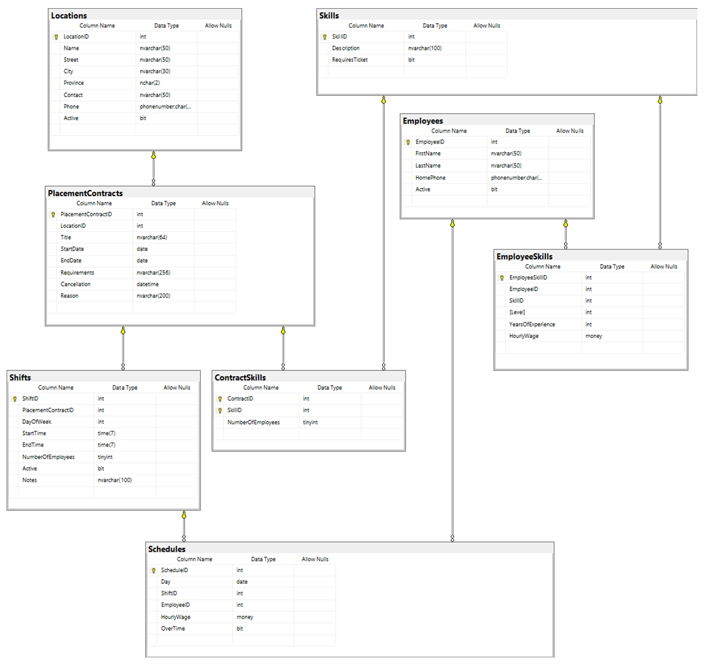

# TRX Implementation Exercise (4 marks)

Using your documentation plan from your Implementation Planning exercise, test your plan by coding a working solution using Linqpad. Incorporate any missed issues from the Implementation Planning exercise outlined by your instructor's review. Follow the guidance and examples given by your instructor for your implementation. 

The form is designed to collect a 
employee skill registration information. The individual may be a completely new employee or an existing employee registering a new skill. Remember that the entire form will be processed as a single transaction in the BLL.

Note the following requirements when processing in the web form and required with the service method(s):

Clear

- Clears the current form of data

Register

- Employee and Skill must not already be registered. 
- First name, Last name and Phone Number are required
- Individuals can have multiple skills. An individual must has at least one skill. For each selected skill:
  - Level is required.
  - Years of Experience (YOE) is optional
    - Years of Experience is a positive non zero integer or is null.
    - Years of Experience (if present) must be in the range of 1 to 50 inclusive.
  - Hourly Wage is required
    - Hourly Wage is a positive no zero decimal
    - Hourly Wage must fall between $15.00 and $100.00 inclusive.

## Requirements

Milestone 

Create a milestone that will represent the creation of the OLTP service for registrating a new employee.

Issue

Create a Linqpad C# coding solution covering the testing of your plan's Data Models and the Business Logic registration service method. Use the Linqpad example for testing demonstrated in class. Create a query that displays the employee record and employee skills. This query should display the employee that was added/updated via the service transaction method.

The issue needs
1. an appropriate title.
1. link to milestone.
1. an opening comment indicating steps for completing the implementation for coding and testing.
