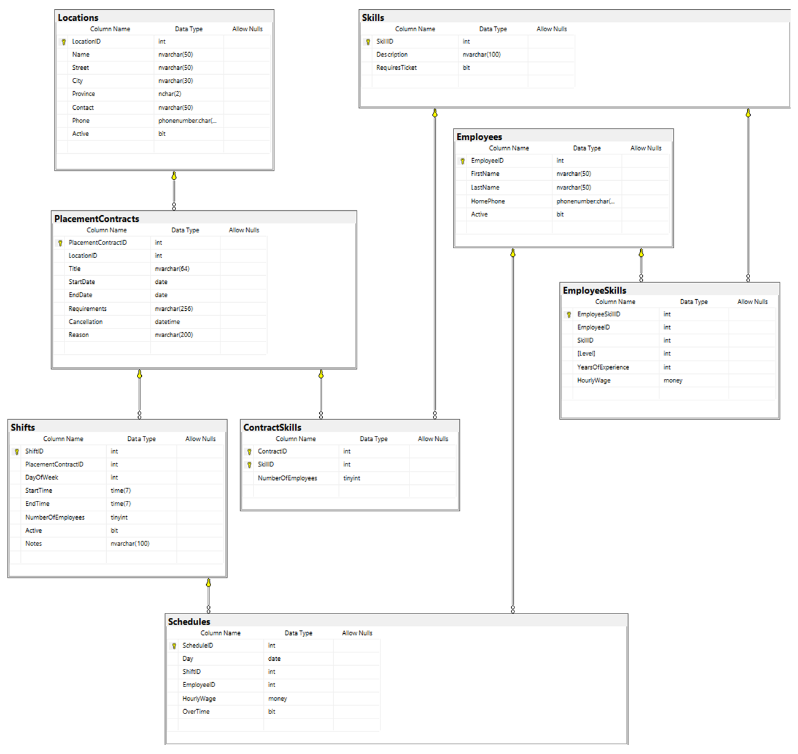

# Implementation Planning Exercise (4 marks)

Given the following user-interface, document your implementation plan for the **transaction service method functionality** of this form. 
Follow the guidance and examples given by your instructor for your implementation plan. The form is designed to collect a 
employee skill registration information. The individual may be a completely new employee or an existing employee registering a new skill. Remember that the entire form will be processed as a single transaction in the BLL.

Note the following requirements when processing in the BLL:

Clear

- Clears the current form of data

Register

- Employee and Skill must not already be registered. 
- First name, Last name and Phone Number are required
- Individuals can have multiple skills. An individual must has at least one skill. For each selected skill:
  - Level is required.
  - Years of Experience (YOE) is optional
    - Years of Experience is a positive non zero integer or is null.
    - Years of Experience (if present) must be in the range of 1 to 50 inclusive.
  - Hourly Wage is required
    - Hourly Wage is a positive no zero decimal
    - Hourly Wage must fall between $15.00 and $100.00 inclusive.

## Requirements

Milestone 

Create a milestone that will represent the creation of the OLTP service for registrating a new employee.

Issue

Create a planning document issue covering the Data Models and the Business Logic registration service method. Use the planning document outline show in class.

The issue needs
1. an appropriate title
1. link to milestone
1. an opening comment indicating steps for completing the implementation of the form
1. a Data Model comment based on CQRS principles representing the classes that
will be used for this form: query and command
1. a Business Logic service method comment indicating the progressing of the transaction. 
    - All validation of the data, presence and value-limits, is to be done in the service method. 
    - Employee with skill must not already be registered. Match employee name and phone along with the skill.